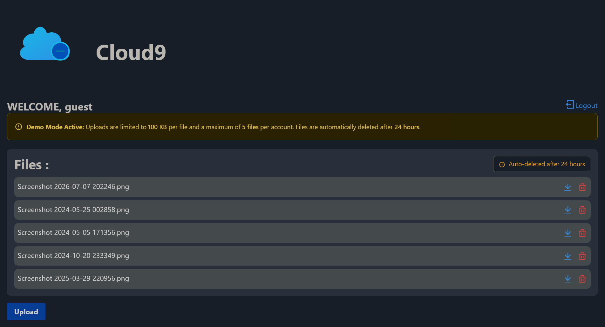
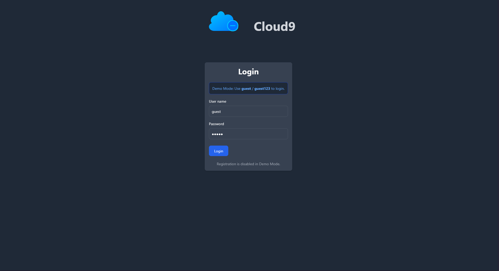

# Cloud9 (DRIVE_clone)


Welcome to **Cloud9** (formerly DRIVE_clone)! This guide will walk you through the project in simple terms, making it easy for beginners to set up, understand, and contribute.

---

## 1. Overview
Cloud9 is a modern web application built using Node.js, Express, and MongoDB. It uses EJS for server-side rendering along with Tailwind CSS and Flowbite for sleek, responsive styling.

### Key Features
- 🔒 **Secure Authentication:** User registration and login with encrypted passwords.
- 🌙 **Modern UI:** Responsive design with full dark mode support.
- ☁️ **Cloud Storage:** Direct file uploads to Firebase.
- ⏱️ **Demo Mode (New!):** Limit uploads, enforce a 24-hour TTL (Time-To-Live) on files, and enable a one-click guest login bypass.
- 🗑️ **File Management (New!):** Upload files via a drag-and-drop modal (now showing selected file names) and easily delete them from both the database and Firebase storage.



---

## 2. Technologies Used

- **Backend:** Node.js, Express, JWT, bcrypt
- **Frontend:** EJS, Tailwind CSS, Flowbite
- **Database:** MongoDB, Mongoose
- **Storage:** Firebase Cloud Storage, Multer

---

## 3. Demo Mode & Recent Updates

We've recently introduced a **Demo Mode** (`DEMO_MODE=true` in `.env`) tailored for public showcases:
1. **Guest Login Bypass:** Disables new registrations and pre-fills the login page with a `guest` / `guest123` account that bypasses the database completely.
2. **File Upload Limits:** Caps uploads at 5 files per account and restricts file sizes to 100 KB.
3. **24-Hour Auto-Deletion:** Automatically deletes uploaded files after 24 hours using MongoDB TTL indexes and UI banners to notify users.
4. **Enhanced UI:** 
   - A functional delete button allows users to immediately delete their files.
   - The drag-and-drop upload form now displays the selected file name before submission.



---

## 4. Project Structure
```text
/DRIVE_clone
│
├── app.js                # Main entry point of the application.
├── .env                  # Environment variables (MongoDB URI, JWT secret).
├── config/               # Database, Firebase, and Multer configs.
├── models/               # Mongoose schemas (User, Files).
├── middlewares/          # JWT authentication middleware.
├── routes/               # Express routes (index, user).
├── views/                # EJS templates (home, login, register).
└── public/               # Static assets (logo.svg).
```

---

## 5. Setup Instructions

### Prerequisites
- Node.js and npm installed.
- MongoDB running locally or a connection string ready.
- A Firebase project configured with Cloud Storage.

### Installation
1. **Clone & Install**
   ```bash
   git clone <your-repo-url>
   cd DRIVE_clone
   yarn install
   ```

2. **Environment Variables**
   Copy the example environment file:
   ```bash
   cp .env.example .env
   ```
   Update `.env` with your credentials:
   ```env
   MONGO_URI=your_mongodb_connection_string
   JWT_SECRET=your_secure_random_string
   DEMO_MODE=false # Set to true to enable demo features
   ```

3. **Set Up Firebase**
   - Create a project in the [Firebase Console](https://console.firebase.google.com).
   - Generate a private key (Project Settings > Service Accounts).
   - Save the JSON file as `firebase-credentials.json` in the root.
   - Update `config/firebase.config.js` with your Firebase bucket name.


---

## 6. Running the Project

Start the server:
```bash
yarn start
```
The server will run on `http://localhost:3000`.

- **Login:** `http://localhost:3000/user/login`
- **Register:** `http://localhost:3000/user/register` (Unless `DEMO_MODE=true`)
- **Home:** `http://localhost:3000/home`

---

## 7. Security Notes
- Never commit `.env` or Firebase credential files.
- Keep your JWT secret secure and randomly generated.
- Regularly rotate Firebase credentials in production.

Enjoy exploring and developing Cloud9!
